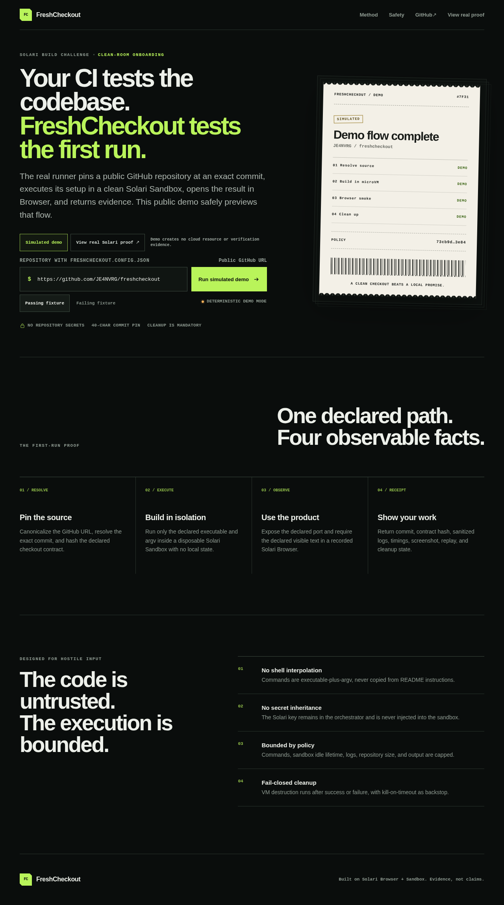

<div align="center">

# FreshCheckout

### Your CI tests the codebase. FreshCheckout tests the first run.

FreshCheckout proves whether a new contributor can execute one declared onboarding path from an immutable commit in a clean machine, then observe the expected product screen.

[Live demo](https://freshcheckout.je4ndev.com) · [Verified live run](https://freshcheckout.je4ndev.com/runs/3f19c13f-cdeb-45dc-878b-b76cde7cf6d7) · [Machine-readable receipt](apps/freshcheckout/evidence/b74e6f4/receipt.json) · [Real provider-drift failure](apps/freshcheckout/evidence/de47fed-provider-drift/README.md) · [Product brief](apps/freshcheckout/PRODUCT.md) · [Checkout contract](freshcheckout.config.json)


</div>



## Why FreshCheckout

A green CI pipeline does not prove that a stranger can start the project.

CI often runs with warm caches, preinstalled tools, hidden environment variables, and team knowledge. A new contributor has none of those advantages. FreshCheckout converts onboarding into a repository-owned executable contract and observes the result in disposable infrastructure.

It answers one bounded question:

> At this immutable commit, did the declared install, test, build, start, and browser assertion succeed from a clean checkout?

It does not claim that the repository is secure, bug-free, production-ready, or fully certified.

## How it works

```text
Public GitHub repository
        │
        ▼
Resolve default branch + immutable 40-character commit
        │
        ▼
Create disposable Solari Sandbox with no repository secrets
        │
        ▼
Clone commit and validate freshcheckout.config.json
        │
        ▼
Run declared executable + argv for install, test, build, start
        │
        ▼
Expose only the declared port
        │
        ▼
Open preview in a recorded Solari Browser
        │
        ▼
Require declared visible text and capture screenshot/replay
        │
        ▼
Generate bounded receipt and destroy every remote resource
```

## Verified evidence

A real Solari Sandbox + Browser run completed against commit:

```text
b74e6f479f4f3529fe512702d41c44b7f1ef8cba
```

| Check | Result |
| --- | --- |
| Immutable commit resolved | Passed |
| Clean Sandbox created | Passed |
| Checkout contract validated and hashed | Passed |
| `npm ci` | Passed |
| Unit and integration tests in Sandbox | Passed |
| Production build | Passed |
| Declared preview | Passed |
| Solari Browser HTTP response | `200` |
| Declared visible assertion | Observed |
| Console errors | `0` |
| Failed browser requests | `0` |
| Screenshot | Captured |
| Private replay | Captured |
| Sandbox cleanup read-back | `0` active |

The complete bounded evidence is committed under [`apps/freshcheckout/evidence/b74e6f4`](apps/freshcheckout/evidence/b74e6f4).

## Public demo

**https://freshcheckout.je4ndev.com**

The public deployment intentionally runs in demo-only mode and has no `SOLARI_API_KEY`. It can demonstrate passing and failing receipts without consuming cloud credits or exposing a live execution endpoint.

The committed evidence above comes from a separate authenticated real-cloud run. Demo receipts are always labeled as simulated and are never presented as verification evidence.

## Checkout contract

A repository opts in with `freshcheckout.config.json`:

```json
{
  "version": 1,
  "workingDirectory": "apps/freshcheckout",
  "commands": {
    "install": { "executable": "npm", "args": ["ci"] },
    "test": { "executable": "npm", "args": ["test"] },
    "build": { "executable": "npm", "args": ["run", "build"] },
    "start": {
      "executable": "node",
      "args": [
        "node_modules/tsx/dist/cli.mjs",
        "src/server/index.ts",
        "--host",
        "0.0.0.0",
        "--port",
        "4317"
      ]
    }
  },
  "port": 4317,
  "assertion": { "text": "Your CI tests the codebase" }
}
```

Commands are data, not shell prose. FreshCheckout rejects traversal, absolute working directories, control characters, shell operators, invalid ports, oversized argv, and empty assertions before execution.

## Safety boundaries

- Public canonical `github.com` repositories only
- Immutable source commit before execution
- No repository or orchestrator secrets inside the Sandbox
- Executable and argv validated separately
- Fixed repository, command, output, log, artifact, and idle-lifetime budgets
- 64 KB command-output ceiling with immediate process termination
- Screenshot and replay size limits
- Receipt and artifact retention limits
- Preview origin allowlist in the Browser
- Public receipts exclude raw preview URLs and session IDs
- Browser and Sandbox cleanup runs after success or failure
- Public deployment is demo-only

Repository files, logs, browser pages, and command output are treated as untrusted data.

## Run locally

Requirements:

- Node.js `>=22.13.0`
- npm
- Optional `SOLARI_API_KEY` for private live runs

```bash
git clone https://github.com/JE4NVRG/freshcheckout.git
cd freshcheckout/apps/freshcheckout
npm ci
npm run dev
```

Open `http://127.0.0.1:4317`.

Without a key, the product remains in deterministic demo mode. Never commit or expose a real Solari key in browser code, logs, screenshots, or public deployment configuration.

## Quality gates

```bash
npm run verify
```

`verify` runs the dependency audit, strict typecheck, lint, 55 unit/integration tests, production build, and Playwright desktop/mobile suite locally. No hosted CI account or Solari credit is required.

Verified baseline:

- 55 unit and integration tests
- TypeScript strict checks
- ESLint clean
- Production build
- Playwright desktop and mobile flows
- 390 px mobile overflow and touch-target checks
- Gitleaks scan on every published commit

## Project structure

```text
apps/freshcheckout/
├── src/client/          React product UI and receipt experience
├── src/core/            Contract, planning, receipt, and redaction logic
├── src/server/          Fastify API, stores, Solari adapters, and runner
├── tests/               Unit, integration, lifecycle, retention, and E2E gates
├── evidence/b74e6f4/    Current verified real-cloud receipt and screenshot
├── evidence/e0f4dbc/    Historical verified real-cloud receipt
├── evidence/de47fed-provider-drift/  Real failed run and remediation
├── PRODUCT.md           Product scope and acceptance criteria
└── README.md            Technical quickstart and receipt semantics

freshcheckout.config.json  Executable checkout contract
```

## Built with Solari

FreshCheckout uses:

- [Solari Sandbox](https://getsolari.com) for disposable isolated execution
- [Solari Browser](https://getsolari.com) for recorded browser observation
- The official [Solari Cookbook](https://github.com/solari-sdk/solari-cookbook) as its upstream fork parent

This project was created for the Solari build challenge and remains visibly linked to the upstream cookbook through GitHub's fork relationship.

## Current scope

FreshCheckout v1 supports one public repository, one checkout contract, and one browser text assertion. It intentionally excludes private repositories, arbitrary host execution, accounts, billing, teams, automatic repair, and security certification.

See [`apps/freshcheckout/PRODUCT.md`](apps/freshcheckout/PRODUCT.md) for the complete boundary and acceptance criteria.

Contributions follow [`CONTRIBUTING.md`](CONTRIBUTING.md). Please report vulnerabilities privately according to [`SECURITY.md`](SECURITY.md).

## License

MIT. The original cookbook examples remain attributed to the [Solari SDK organization](https://github.com/solari-sdk).
